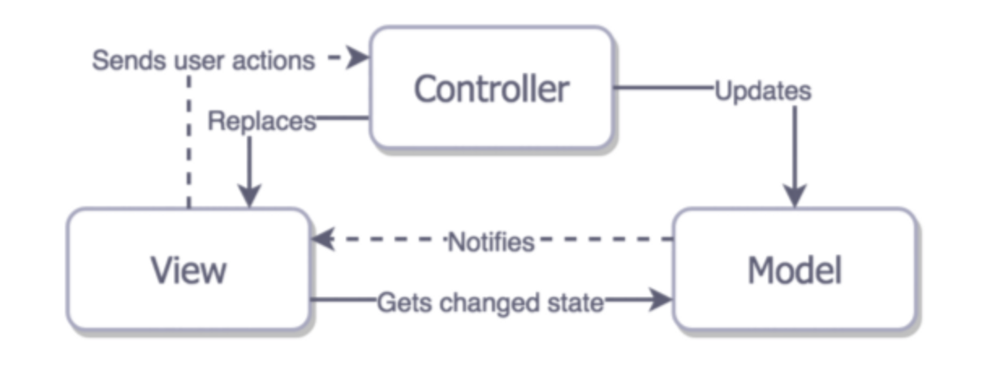
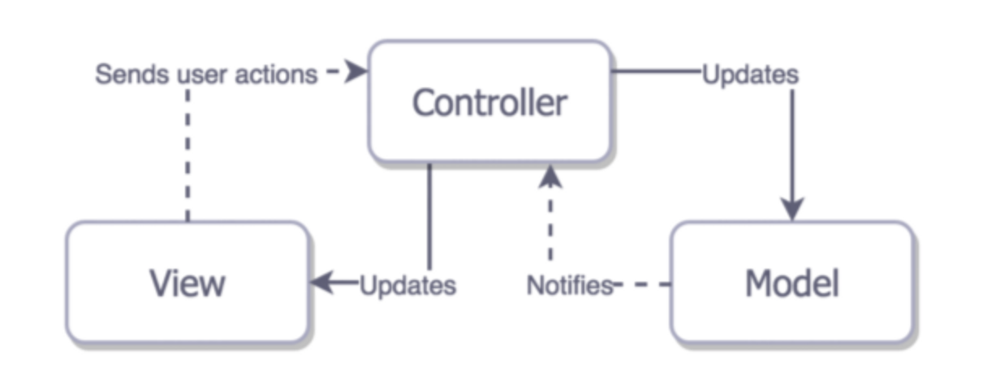
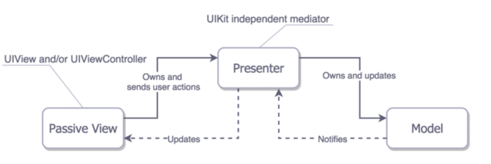
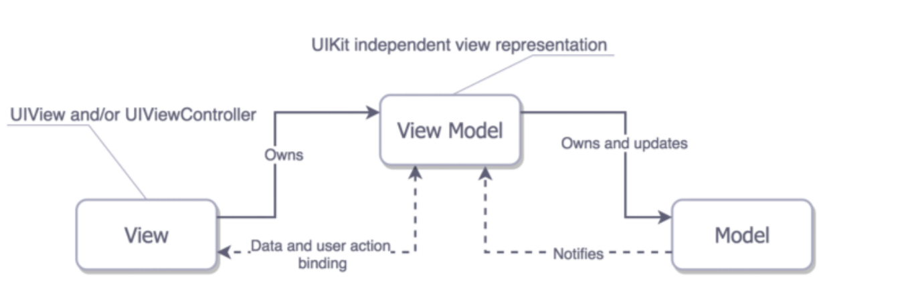

#### 一.前言

>本次我们一起探讨学习MVC、MVP和MVVM之间的联系和区别。
	
MV(X)系列简单概要：

1、Models：负责主要的数据或者操作数据的数据访问层；

2、Views：负责展示层，对于IOS环境可以联想一下以UI开头的所有类；

3、Controller/Persenter/ViewModel：负责协调Model和View，通常根据用户在View上的动作在Model上作出对应的更改，同时将更改的信息返回到View上；

### 二.MVC模式介绍
#### 1.传统的MVC模式介绍

在MVC里，View是可以直接访问Model的！从而，View里会包含Model信息，不可避免的还要包括一些业务逻辑。 在MVC模型里，更关注的Model的不变，而同时有多个对Model的不同显示，及View。所以，在MVC模型里，Model不依赖于View，但是 View是依赖于Model的。不仅如此，因为有一些业务逻辑在View里实现了，导致要更改View也是比较困难的，至少那些业务逻辑是无法重用的。

	
#### 2.期望的MVC愿景
Controller是一个介于View 和 Model之间的协调器，所以View和Model之间没有任何直接的联系。逻辑复杂度较高的代码，而这些代码又不适合放在Model中，我们就放在Controller里面了。理论上来讲，这种模式看起来非常直观，但是会发现这种模式驱使我们写出臃肿的视图控制器，因为它们经常被混杂到View的生命周期中，因此很难说View和ViewController是分离的。尽管仍可以将业务逻辑和数据转换到Model，但是大多数情况下当需要为View减负的时候我们却无能为力了。

MVC的一系列特征：

**任务分配**：View和Model是分开的，但是View和Controller却是紧密耦合的；

**可测试性**：由于糟糕的分散性，只能对Model进行测试；

**易用性**：与其他几种模式相比最小的代码量。熟悉的人很多，因而即使对于经验不那么丰富的开发者来讲维护起来也较为容易。

### 三.MVP模式介绍
MVP是从经典的模式MVC演变而来，它们的基本思想有相通的地方：Controller/Presenter负责逻辑的处理，Model提供数据，View负责显示。作为一种新的模式，MVP与MVC有着一个重大的区别：在MVP中View并不直接使用Model，它们之间的通信是通过Presenter (MVC中的Controller)来进行的，所有的交互都发生在Presenter内部。MVC模式View是和Controller紧密耦合的，但是MVP的协调器Presenter并没有对ViewController的生命周期做任何改变，因此View可以很容易的被模拟出来。在Presenter中没有和布局有关的代码，但是它负责更新View的数据和状态。

MVP是一个如何协调整合三个实际上分离的层次的架构模式，既然我们不希望View涉及到Model，那么在显示的ViewController（其实就是View）中处理这种协调的逻辑就是不正确的，因此我们需要在其他地方来做这些事情。例如，我们可以做基于整个App范围内的路由服务，由它来负责执行协调任务，以及View到View的展示。这个出现并且必须处理的问题不仅仅是在MVP模式中，同时也存在于以下集中方案中。

**任务分配**：将最主要的任务划分到Presenter和Model，而View的功能较少；

**可测试性**：非常好，由于一个功能简单的View层，所以测试大多数业务逻辑也变得简单

**易用性**：代码量比MVC模式的多，但MVP的概念却非常清晰
	
### 四.MVVM模式介绍
MVVM（Model-View-ViewModel）框架的由来便是MVP（Model-View-Presenter）模式与WPF结合的应用方式时发展演变过来的一种新型架构框架。它和MVP模式看起来非常像，MVVM将ViewController视作View，在View和Model之间没有紧密的联系。此外，它还有像监管版本的MVP那样的绑定功能，但这个绑定不是在View和Model之间而是在View和ViewModel之间。

在iOS中ViewModel实际上代表什么？它基本上就是UIKit下的每个控件以及控件的状态。ViewModel调用会改变Model同时会将Model的改变更新到自身并且因为我们绑定了View和ViewModel，第一步就是相应的更新状态。

**任务分配**：MVVM的View要比MVP中的View承担的责任多。因为前者通过ViewModel的设置绑定来更新状态，而后者只监听Presenter的事件但并不会对自己有什么更新；
	
**可测试性**：ViewModel不知道关于View的任何事情，这允许我们可以轻易的测试ViewModel；

**易用性**：代码量和MVP的差不多，但是在实际开发中，我们必须把View中的事件指向Presenter并且手动的来更新View，如果使用绑定的话，MVVM代码量将会小的多。

### 五.结语

在同一个应用中包含着多种架构。比如，你开始的时候使用MVC，然后突然意识到一个页面在MVC模式下的变得越来越难以维护，然后就切换到MVVM架构，但是仅仅针对这一个页面。并没有必要对哪些MVC模式下运转良好的页面进行重构，因为二者是可以并存的。