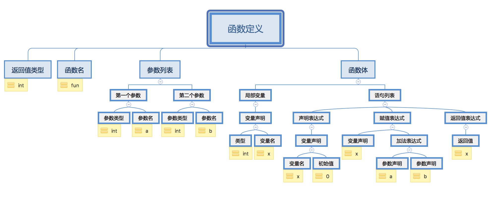

# 当运行Hello程序时系统发生了什么

> 一个简单的hello程序是怎么被运行起来的。


```
#include <stdio.h>

int main()
{
    printf("hello,world\n");
}
```

### 一、源程序
`hello`程序的生命周期是从一个源程序开始的，就是我们利用编辑器创建并保存的文本文件，文件名是`hello.c`。源程序就是一个0和1组成的位序列，8个位被组织成一组，就是我们所说的字节。每个字节表示程序中某个文本字符。大部分的现代系统都是使用ASCII标准来表示文本字符，这种方式实际就是用唯一的单字节大小的整数值来表示每个字符。

比如hello程序里的第一行代码对应的`ASCII`码表示：
    
```
#   i   n   c   l   u   d   e   <sp>  <   s   t   d   i   o   .   h   >
35 105 110  99  108 117 100 101  32   60  115 116 100 105 111 46 104 62   

```
    
第一个字节的整数值是35，它对应的就是字符`#`;第二个字节整数值是105，它对应的字符是`i`，以此类推。

其实系统中所有的信息，包括磁盘文件、存储器中的程序、存储器中存放的用户数据以及网络上传送的数据，都是一串位表示的。区分数据对象的唯一方法是我们读到这些数据对象时的上下文。比如，在不同的上下文中，一个同样的字节序列可能表示一个整数、浮点数、字符串或者机器指令。

这里我们可以了解到数字的机器表示方式，它们与实际的整数和实数是不同的，它们是对真值有限近似值，可能会有意想不到的行为表现。

### 二、程序被翻译为不同的格式

`hello`程序是用C语言编写，因为这种形式能够被人读懂，然而计算机不懂，为了在系统上运行`hello.c`程序，每条C语句都必须被其他程序转化成一系列低级的机器语言指令。然后这些指令按照可执行目标程序的格式打好包，并以二进制磁盘文件的形式存放起来。当我们执行命令`gcc -o hell hello.c`，就是从源文件到目标文件的转化，在这里GCC把源程序翻译成一个可执行目标文件，翻译过程分为四个阶段，读者应该都非常熟悉了，包括预处理、编译、汇编，链接。执行这四个阶段的程序，一起构成了编译系统。那么我们看下每个流程具体做了什么。

#### 1,预处理
预处理器根据字符`#`开头的命令，修改原始C程序，比如第一行的`#include <stdio.h>`命令告诉预处理读取系统头文件`stdio.h`的内容，并把它直接插入到程序文本中。结果就得到了另一个C程序`hello.i`，以`.i`作为文件扩展名.

#### 2,编译阶段
编译器将`hello.i`翻译成文本文件`hello.s`，这个过程会做词法分析、语法分析、生成中间代码。
##### 2.1词法分析
高级语言程序形式是能够被人读懂的，编译器不能像人一样，一看就明白源代码的意思，它只能逐个单词分析。那么词法分析要做的就是把源代码分隔成若干个单词，但是也并不简单，比如:

```
1,float a 表示一个浮点数，而floata只是一个变量名;

2,b =没有具体意义，可以是一个赋值语句，b == 1的前缀表示一个判断。

```
主要难点在于，前缀无法决定一个完整字符串的含义，通常看完整句以后才知道每个单词的具体含义。同时，各种语言的语法也不简单，各种关键字，括号，逗号，语法等等都会给词法分析的实现增加难度。主要实现原理是状态机，它逐个读取字符，然后根据读到的字符的特点转换状态。可以参考GCC 的词法分析状态机(《编译系统透视》)。


##### 2.2,语法分析：
词法分析以后，编译器已经知道了每个单词，但这些单词组合起来表示的语法还不清楚。语法分析就是将字符串格式的源代码解析转化为树状的数据结构。以下代码为例

```
int fun(int a, int b){
    int x = 1;
    x=a+b;
    return x;
}
```
生成语法树：


##### 2.3,生产中间代码：

生成中间代码是非常重要的一步，一方面它和语言无关，也和`CPU`与具体实现无关。可以理解为中间代码是一种非常抽象，又非常普适的代码。它客观中立的描述了代码要做的事情，如果用中文、英文来分别表示 `C` 和 `Java` 的话，中间码某种意义上可以被理解为世界语。

##### 2.4,生产目标代码：
目标代码也可以叫做汇编代码。由于中间代码已经非常接近于实际的汇编代码，它几乎可以直接被转化。主要的工作量在于兼容各种`CPU`以及填写模板。

#### 3,汇编：
汇编器将`hello.s`翻译成机器语言指令，是可重定位目标程序，保存在`hello.o`文件中。`hello.o`是一个二进制文件，它的字节编码是机器语言指令，不是字符。

#### 4,链接:
链接器负责处理合并，比如`hello`程序中调用了`printf`函数，是标准C库的一个函数，`printf`函数存在于一个名为`printf.o`的单独的预编译好了的目标文件中，链接器就是负责把这个文件合并到`hello.o`程序中。我们知道函数调用对应到汇编其实是 `jump` 指令，后面写上被调用函数的地址，但在生成 `main.o` 的过程中，`printf`函数的地址并不知道，所以只能先用 `0` 来代替，直到最后链接时，才会修改成真实的地址。在链接阶段，链接器会根据重定位表中，需要重定位的内容，去别的目标文件中找到地址并进行重定位。我们听到的动态链接这个名词，它表示重定位发生在运行时而非编译后。链接后结果就得到`hello.o`文件，它是一个可执行目标文件，可以被加载到内存中，由系统执行。

### 三，处理器读取并解释存储在存储器中的指令
>当我们运行hello程序是，发生了什么。

此时`hello.c`源程序已经被编译系统翻译成可执行目标文件`hello.o`,存放在磁盘上。我们把它的文件名`hello`输入到外壳`（shell）`应用程序中，运行可执行文件。它打印了`hello,world`。这个过程是怎么发生的呢。

```
> ./hello
hello, world
> 
```
1，当我们在键盘输入`./hello`后，外壳程序将字符逐一读入寄存器，再把它放到存储器中

2，当我们敲回车键时，外壳程序知道我们已经结束了命令输入，然后外壳程序来加载可执行的`hello`文件，将`hello`目标文件的代码和数据从磁盘复制到主存，包括最终被输出的字符串`"hello，world"`。

3，目标文件`hello`中的代码和数据被加载到主存，处理器就开始执行`hello`程序的`main`程序中的机器语言指令，这些指令将`"hello，world\n"`字符串中的字节从主存复制到寄存器文件，再从寄存器文件中复制到显示设备，最终显示在屏幕上。